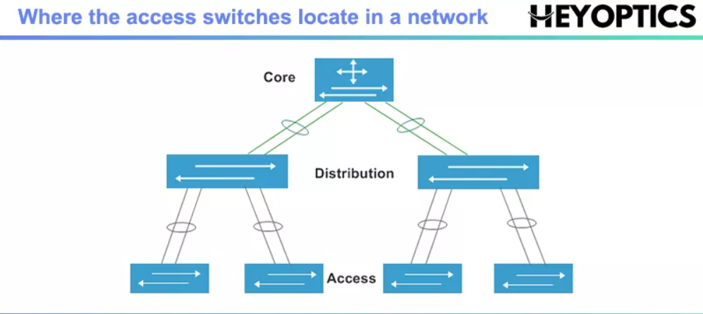

## 什么是Access Switch?
<!-- TOC -->

- [什么是Access Switch?](#什么是access-switch)
  - [What is the access switch?](#what-is-the-access-switch)
  - [What does an Access Layer Switch do?](#what-does-an-access-layer-switch-do)
  - [The Difference Between Access Switch and Other Switches](#the-difference-between-access-switch-and-other-switches)
  - [The Important Features of Access Switch](#the-important-features-of-access-switch)
  - [Conclusion](#conclusion)

<!-- /TOC -->
A typical enterprise hierarchical LAN campus network design includes an access layer, distribution layer, and the core layer. In each layer, the enterprise switches are categorified, among which the access switch is a key part at which local end-users are allowed into the network. This article will introduce what the access switch is and how to select the right access layer switches for your enterprise network. In the meanwhile, some important features of the access switch will be introduced as well.

### What is the access switch?

The access switch is the only one that directly interacts with end-user devices. Because an access network switch connects the majority of devices to the network, it normally has the highest port density of all switch types. In spite of the high port count, the access switch usually provides the lowest throughput per port. For example, most modern access switches come with a 10/100/1000Mbps copper Ethernet connection to end devices. While core and distribution switches commonly use between 10Gbps and 100Gbps fiber optic ports.

### What does an Access Layer Switch do?

As the physical entity of the access layer, access switches are responsible to connect both to the distribution layer switches and the end devices as well as ensure the packets are delivered to the end devices. Besides ensuring the persistent connection of end users as well as the upper distribution and core layers, an access switch is expected to meet the requirement of the access layer including simplifying the network management, providing security services, and other specific functions according to the different network environments.

### The Difference Between Access Switch and Other Switches
Access switch, distribution switch, and core switch perform different functions. Distribution switches collect the data from all the access switches and then forward it to the core layer switches. A core switch is a high-capacity switch that is generally positioned within the backbone or physical core of a network. In small networks where there are only a few servers and clients, access to Ethernet switches are adequate without needing core switches or distribution switches. What is more, there are generally only one or two core switches used in a small or middle-sized network, but the distribution layer and the access layer might have multiple switches. The figure below shows where the access switches locate in a network.

### The Important Features of Access Switch
Access layer switch facilitates the connection of end node devices to the network, such as PC, modems, IP phones, printers, etc. On this account, they offer many features that the upper tiers do not require. For example, an access switch can create separate collision domains for each connected node to improve performance. What is more, some access switches support Power over Ethernet. An access Gigabit PoE switch can supply power to many endpoint devices, including wireless access points and security cameras. Additionally, the access layer switch is more adept at interacting with endpoints from a security perspective. Port security, 802.1X authentication, and other security mechanisms are built directly onto access switch software.

### Conclusion
In the construction of a network, there might be the access switch, distribution switch, and core switch. Although the access switch is not usually used on a large network, a smaller network is where the access switch comes in. As the demand for higher Ethe thernet speeds and more enhanced link utilization increases, data center networking is requiring the 10GbE switch at the access layer to optimize performance.
Overall, access switches are supposed to feature with simplicity, reliability, and security. When selecting the access layer switches, the primary step is to assess your business needs and choose a product that best addresses these specifications.