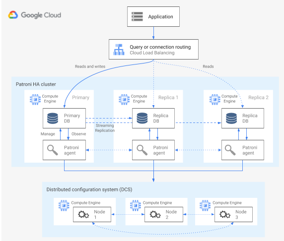
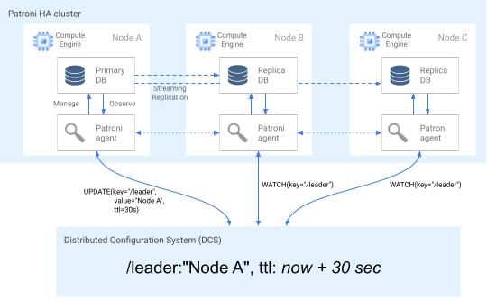
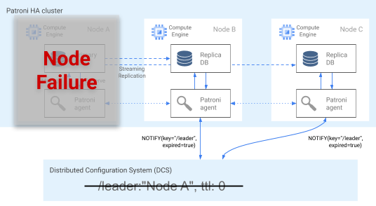
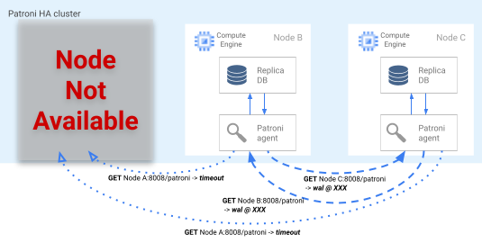
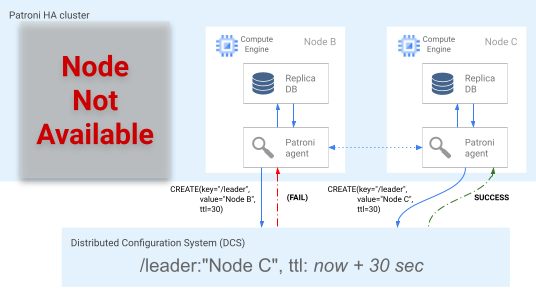
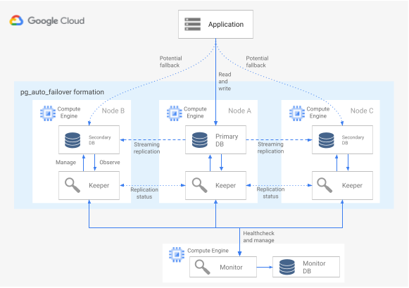
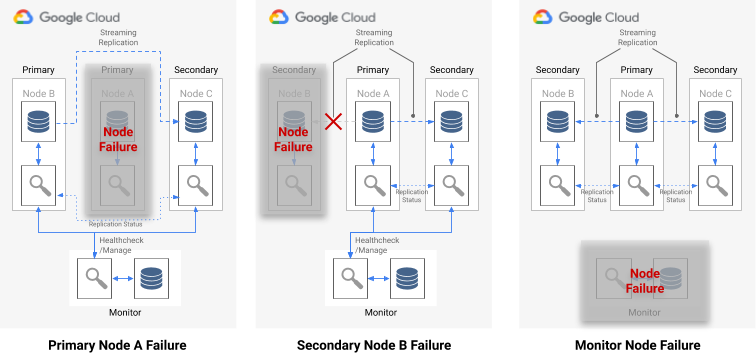

# Architectures for high availability of PostgreSQL clusters 

<!-- TOC -->

- [Architectures for high availability of PostgreSQL clusters](#architectures-for-high-availability-of-postgresql-clusters)
  - [Terminology](#terminology)
  - [When to consider an HA architecture](#when-to-consider-an-ha-architecture)
    - [Consider your requirements for HA](#consider-your-requirements-for-ha)
  - [How HA works](#how-ha-works)
    - [Streaming replication](#streaming-replication)
    - [Synchronous streaming replication](#synchronous-streaming-replication)
  - [PostgreSQL HA architectures](#postgresql-ha-architectures)
  - [HA using the Patroni template](#ha-using-the-patroni-template)
    - [Failure detection](#failure-detection)
    - [Failover process](#failover-process)
    - [Query routing](#query-routing)
    - [Fallback process](#fallback-process)
  - [HA using the pg_auto_failover extension and service](#ha-using-the-pg_auto_failover-extension-and-service)
    - [Monitor service](#monitor-service)
    - [Failure detection](#failure-detection-1)
    - [Failover process](#failover-process-1)
    - [Query routing](#query-routing-1)
    - [Fallback and switchover processes](#fallback-and-switchover-processes)
  - [Comparison between the HA options](#comparison-between-the-ha-options)
    - [Setup and architecture](#setup-and-architecture)
    - [High availability configurability](#high-availability-configurability)
    - [Ability to handle network partition](#ability-to-handle-network-partition)
    - [Client configuration](#client-configuration)
    - [Automation of PostgreSQL node initialization, configuration management](#automation-of-postgresql-node-initialization-configuration-management)
    - [Customizability and feature richness](#customizability-and-feature-richness)
    - [Maturity](#maturity)
  - [Related Blogs](#related-blogs)

<!-- /TOC -->
This article describes several architectures that provide high availability (HA) for PostgreSQL deployments on Google Cloud. HA is the measure of system resiliency in response to underlying infrastructure failure. In this document, HA refers to the availability of PostgreSQL clusters either within a single cloud region or between multiple regions, depending on the HA architecture.

This document is intended for database administrators, cloud architects, and DevOps engineers who want to learn how to increase PostgreSQL data-tier reliability by improving overall system uptime. This document discusses concepts relevant to running PostgreSQL on Compute Engine. The document doesn't discuss using Cloud SQL for PostgreSQL.

If a system or application requires a persistent state to handle requests or transactions, the data persistence layer (the data tier) must be available to successfully handle requests for data queries or mutations. Downtime in the data tier prevents the system or application from performing the necessary tasks.

Depending on the service level objectives (SLOs) of your system, you might require an architecture that provides a higher level of availability. There is more than one way to achieve HA, but in general you provision redundant infrastructure that you can quickly make accessible to your application.

This document discusses the following topics:

- Definition of terms related to HA database concepts.
- Options for HA PostgreSQL topologies.
- Contextual information for consideration of each architecture option.
## Terminology
The following terms and concepts are industry-standard, and they are useful to understand for purposes beyond the scope of this document.

- replication

The process by which write transactions (INSERT, UPDATE, or DELETE) and schema changes ([data definition language (DDL)](http://wikipedia.org/wiki/Data_definition_language)) are reliably captured, logged, and then serially applied to all downstream database replica nodes in the architecture.
- primary node
  
The node that provides a read with the most up-to-date state of persisted data. All database writes must be directed to a primary node.

- replica (secondary) node
  
An online copy of the primary database node. Changes are either synchronously or asynchronously replicated to replica nodes from the primary node. You can read from replica nodes with the understanding that the data might be slightly delayed due to replication lag.

- replication lag

A measurement, in log sequence number (LSN), transaction ID, or time. Replication lag expresses the difference between when change operations are applied to the replica compared to when they are applied to the primary node.

- continuous archiving

An incremental backup in which the database continuously saves sequential transactions to a file.

- write-ahead log (WAL)

A log that records changes to data files before the changes are made to the files. The 64-bit integer log sequence number identifies the position in the WAL file.

- WAL record

A record of a transaction that was applied to the database. A WAL record is formatted and stored as a series of records that describe data file page-level changes.

- segment files

Files that contain as many WAL records as possible, depending on the file size that you configure. Segment files have monotonically increasing filenames and a default file size of 16 MiB.
synchronous replication
A form of replication in which the primary server waits for the replica to confirm that data was written to the replica transaction log before confirming a commit to the client. When you run streaming replication, you can use the PostgreSQL synchronous_commit option to configure consistency guarantees.
- asynchronous replication

A form of replication in which the primary server doesn't wait for the replica to confirm that the transaction was successfully received before confirming a commit to the client. Asynchronous replication has lower latency when compared with synchronous replication. However, if the primary crashes and its committed transactions aren't transferred to the replica, there is a chance of data loss. Asynchronous replication is the default mode of replication on PostgreSQL, either using file-based log shipping or streaming replication.

- file-based log shipping

A replication method in PostgreSQL that transfers the WAL segment files from the primary database server to the replica. The primary operates in continuous archiving mode, while each standby service operates in continuous recovery mode to read the WAL files. This replication is asynchronous.

- streaming replication

A replication method wherein the replica connects to the primary and continuously receives a continuous sequence of changes. Because updates arrive through a stream, this method keeps the replica more up-to-date with the primary when compared with log-shipping replication. Although replication is asynchronous by default, you can alternatively configure synchronous replication.

- physical streaming replication

A replication method that transports changes to the replica. This method uses the WAL records that contain the physical data changes in the form of disk block addresses and byte-by-byte changes.

- logical streaming replication

A replication method that captures changes based on their replication identity (primary key) which allows for more control over how the data is replicated compared to physical replication. Because of [restrictions in PostgreSQL logical replication](https://www.postgresql.org/docs/current/logical-replication-restrictions.html), logical streaming replication requires special configuration for an HA setup. This guide discusses the standard physical replication and doesn't discuss logical replication.

- uptime
  
The percent of time that a resource is working and capable of delivering a response to a request.

- failure detection

The process of identifying that an infrastructure failure has occurred.

- failover

The process of promoting the backup or standby infrastructure (in this case, the replica node) to become the primary infrastructure. During failover, the replica node becomes the primary node.

- switchover

The process of running a manual failover on a production system. A switchover either tests that the system is working well, or takes the current primary node out of the cluster for maintenance.

- recovery time objective (RTO)
  
The elapsed, real-time duration for the data tier failover process to complete. RTO depends on the amount of time that's acceptable from a business perspective.

- recovery point objective (RPO)

The amount of data loss (in elapsed real time) for the data tier to sustain as a result of failover. RPO depends on the amount of data loss that's acceptable from a business perspective.

- fallback

The process of reinstating the former primary node after the condition that caused a failover is remedied.

- self-healing.

The capability of a system to resolve issues without external actions by a human operator.

- network partition

A condition when two nodes in an architecture—for example the primary and replica nodes—can't communicate with one another over the network.

- split brain

A condition that occurs when two nodes simultaneously believe that they are the primary node.

- node group

A set of compute resources that provide a service. In this document, that service is the data persistence tier.

- witness or quorum node

A separate compute resource that helps a node group determine what to do when a split-brain condition occurs.

- primary or leader election

The process by which a group of peer-aware nodes, including witness nodes, determine which node should be the primary node.

## When to consider an HA architecture
HA architectures provide increased protection against data-tier downtime when compared to single node database setups. To select the best option for your business use case, you need to understand your tolerance for downtime, and the respective tradeoffs of the various architectures.

Use an HA architecture when you want to provide increased data-tier uptime to meet the reliability requirements for your workloads and services. If your environment tolerates some amount of downtime, an HA architecture might introduce unnecessary cost and complexity. For example, development or test environments infrequently need high database tier availability.

### Consider your requirements for HA

Following are several questions to help you decide what PostgreSQL HA option is best for your business:

- **What level of availability do you hope to achieve?**
  
Do you require an option that allows your service to continue to function during only a single zone or complete regional failure? Some HA options are limited to a region while others can be multi-region.

- **What services or customers rely on your data tier, and what is the cost to your business if there is downtime in the data persistence tier?**
  
 If a service caters only to internal customers who require occasional use of the system, it likely has lower availability requirements than an end-customer facing service that serves customers continually.

- **What is your operational budget?**
  
Cost is a notable consideration: to provide HA, your infrastructure and storage costs are likely to increase.

- **How automated does the process need to be, and how quickly do you need to fail over? (What is your RTO?)** 
  
HA options vary by how quickly the system can failover and be available to customers.

- **Can you afford to lose data as a result of the failover? (What is your RPO?)**

Because of the distributed nature of HA topologies, there is a tradeoff between commit latency and risk of data loss due to a failure.

## How HA works

This section describes streaming and synchronous streaming replication that underlie PostgreSQL HA architectures.

### Streaming replication
Streaming replication is a replication approach in which the replica connects to the primary and continuously receives a stream of WAL records. Compared to log-shipping replication, streaming replication allows the replica to stay more up-to-date with the primary. PostgreSQL offers built-in streaming replication beginning in version 9. Many PostgreSQL HA solutions use the built-in streaming replication to provide the mechanism for multiple PostgreSQL replica nodes to be kept in sync with the primary. Several of these options are discussed in the PostgreSQL HA architectures section later in this document.

Each replica node requires dedicated compute and storage resources. Replica node infrastructure is independent from the primary. You can use replica nodes as hot standbys to serve read-only client queries. This approach allows read-only query load-balancing across the primary and one or more replicas.

Streaming replication is by default asynchronous; the primary doesn't wait for a confirmation from a replica before it confirms a transaction commit to the client. If a primary suffers a failure after it confirms the transaction, but before a replica receives the transaction, asynchronous replication can result in a data loss. If the replica is promoted to become a new primary, such a transaction would not be present.

### Synchronous streaming replication

You can configure streaming replication as synchronous by choosing one or more replicas to be a synchronous standby. If you configure your architecture for synchronous replication, the primary doesn't confirm a transaction commit until after the replica acknowledges the transaction persistence. Synchronous streaming replication provides increased durability in return for a higher transaction latency.

The synchronous_commit configuration option also lets you configure the following progressive replica durability guarantees for the transaction:

- **on [default]**: synchronous standby replicas write the committed transactions to their WAL before they send acknowledgment to the primary. Using the on configuration ensures that the transaction can only be lost if the primary and all synchronous standby replicas suffer simultaneous storage failures. Because the replicas only send an acknowledgment after they write WAL records, clients that query the replica won't see changes until the respective WAL records are applied to the replica database.
- **remote_write**: synchronous standby replicas acknowledge receipt of the WAL record at the OS level, but they don't guarantee that the WAL record was written to disk. Because remote_write doesn't guarantee that the WAL was written, the transaction can be lost if there is any failure on both the primary and secondary before the records are written. `remote_write` has lower durability than the on option.
- **remote_apply**: synchronous standby replicas acknowledge transaction receipt and successful application to the database before they acknowledge the transaction commit to the client. Using the remote_apply configuration ensures that the transaction is persisted to the replica, and that client query results immediately include the effects of the transaction. `remote_apply` provides increased durability and consistency compared to `on` and `remote_write`.

## PostgreSQL HA architectures
At the most basic level, data tier HA consists of the following:

- A mechanism to identify if a failure of the primary node occurs.
- A process to perform a failover in which the replica node is promoted to be a primary node.
- A process to change the query routing so that application requests reach the new primary node.
- Optionally, a method to fallback to the original architecture using pre-failover primary and replica nodes in their original capacities.

The following sections provide an overview of the following HA architectures:

- The Patroni template
- pg_auto_failover extension and service
- Stateful MIGs and regional persistent disk

These HA solutions minimize downtime if there is an infrastructure or zonal outage. When you choose between these options, balance commit latency and durability according to your business needs.

A critical aspect of an HA architecture is the time and manual effort that are required to prepare a new standby environment for subsequent failover or fallback. Otherwise, the system can only withstand one failure, and the service doesn't have protection from an SLA violation. We recommend that you select an HA architecture that can perform manual failovers, or switchovers, with the production infrastructure.

## HA using the Patroni template

[Patroni](https://github.com/zalando/patroni) is a mature and actively maintained, open source (MIT licensed) software template that provides you with the tools to configure, deploy, and operate a PostgreSQL HA architecture. Patroni provides a shared cluster state and an architecture configuration that is persisted in a distributed configuration store (DCS). Options for implementing a DCS include: [etcd](https://etcd.io/), [Consul](https://www.consul.io/docs/intro), [Apache ZooKeeper](https://zookeeper.apache.org/), or Kubernetes. The following diagram shows the major components of a Patroni cluster.

Figure 1. Diagram of the major components of a Patroni cluster.

In figure 1, the load balancers front the PostgreSQL nodes, and the DCS and the Patroni agents operate on the PostgreSQL nodes.

Patroni runs an agent process on each PostgreSQL node. The agent process manages the PostgreSQL process and data node configuration. The Patroni agent coordinates with other nodes through the DCS. The Patroni agent process also exposes a REST API that you can query to determine the PostgreSQL service health and configuration for each node.

To assert its cluster membership role, the primary node regularly updates the leader key in the DCS. The leader key includes a time to live (TTL). If the TTL elapses without an update, the leader key is evicted from the DCS, and the leader election starts to select a new primary from the candidate pool.

The following diagram shows a healthy cluster in which Node A successfully updates the leader lock.

Figure 2. Diagram of a healthy cluster.

Figure 2 shows a healthy cluster: Node B and Node C watch while Node A successfully updates leader key.

### Failure detection
The Patroni agent continuously telegraphs its health by updating its key in the DCS. At the same time, the agent validates PostgreSQL health; if the agent detects an issue, it either self-fences the node by shutting itself down, or demotes the node to a replica. As shown in the following diagram, if the impaired node is the primary, its leader key in the DCS expires, and a new leader election occurs.

**Figure 3**. Diagram of an impaired cluster.

Figure 3 shows an impaired cluster: a down primary node hasn't recently updated its leader key in the DCS, and the non-leader replicas are notified that the leader key has expired.

On Linux hosts, Patroni also runs an [OS-level watchdog](https://patroni.readthedocs.io/en/latest/watchdog.html) on primary nodes. This watchdog listens for keep-alive messages from the Patroni agent process. If the process becomes unresponsive, and the keep alive isn't sent, the watchdog restarts the host. The watchdog helps prevent a split brain condition in which the PostgreSQL node continues to serve as the primary, but the leader key in the DCS expired due to agent failure, and a different primary (leader) was elected.

### Failover process

If the leader lock expires in the DCS, the candidate replica nodes begin a leader election. When a replica discovers a missing leader lock, it checks its replication position compared to the other replicas. Each replica uses the REST API to get the WAL log positions of the other replica nodes, as shown in the following diagram.

**Figure 4**. Diagram of the Patroni failover process.

Figure 4 shows WAL log position queries and respective results from the active replica nodes. Node A isn't available, and the healthy nodes B and C return the same WAL position to each other.

The most up-to-date node (or nodes if they are at the same position) simultaneously attempt to acquire the leader lock in the DCS. However, only one node can create the leader key in the DCS. The first node to successfully create the leader key is the winner of the leader race, as shown in the following diagram.

Figure 5. Diagram of the leader race.

Figure 5 shows a leader race: two leader candidates try to obtain the leader lock, but only one of the two nodes, Node C, successfully sets the leader key and wins the race.

Upon winning the leader election, the replica promotes itself to be the new primary. Starting at the time that the replica promotes itself, the new primary updates the leader key in the DCS to retain the leader lock, and the other nodes serve as replicas.

Patroni also provides the `patronictl` control tool that lets you run switchovers to test the nodal failover process. This tool helps operators to test their HA setups in production.

### Query routing
The Patroni agent process that runs on each node exposes REST API endpoints that reveal the current node role: either primary or replica.

REST endpoint	| HTTP return code if primary	|HTTP return code if replica
-----|-----|------
/primary	|200|	503
/replica	|503	|200

Because the relevant health checks change their responses if a particular node changes its role, a load balancer health check can use these endpoints to inform primary and replica node traffic routing. The Patroni project provides template configurations for the HA proxy load balancer. [The Internal TCP/UDP Load Balancing](https://cloud.google.com/load-balancing/docs/internal) can use these same health checks to provide similar functionality.

### Fallback process
If there is a node failure, a cluster is left in a degraded state. Patroni's fallback process helps to restore an HA cluster back to a healthy state after a failover. The fallback process manages the return of the cluster to its original state by automatically initializing the impacted node as a cluster replica.

For example, a node might restart due to a failure in the operating system or underlying infrastructure. If the node is the primary and takes longer than the leader key TTL to restart, a leader election is triggered and a new primary node is selected and promoted. When the stale primary Patroni process starts, it detects that it doesn't have the leader lock, automatically demotes itself to a replica, and joins the cluster in that capacity.

If there is an unrecoverable node failure, such as an unlikely zonal failure, you need to start a new node. A database operator can manually start a new node, or you can use a [stateful regional managed instance group (MIG)](https://cloud.google.com/compute/docs/instance-groups/stateful-migs) with a minimum node count to automate the process. After the new node is created, Patroni detects that the new node is part of an existing cluster and automatically initializes the node as a replica.

## HA using the pg_auto_failover extension and service
[pg_auto_failover](https://github.com/citusdata/pg_auto_failover) is an actively developed, open source (PostgreSQL license) PostgreSQL extension. pg_auto_failover configures an HA architecture by extending existing PostgreSQL capabilities. pg_auto_failover doesn't have any dependencies other than PostgreSQL.

To use the pg_auto-failover extension with an HA architecture, you need at least three nodes, each running PostgreSQL with the extension enabled. Any of the nodes can fail without affecting the uptime of the database group. A collection of nodes managed by pg_auto_failover is called a *formation*. The following diagram shows a pg_auto_failover architecture.

**Figure 6**. Diagram of a pg_auto_failover architecture.

Figure 6 shows a pg_auto_failover architecture that consists of two main components: the Monitor service and the Keeper agent. Both the Keeper and Monitor are contained in the pg_auto_failover extension.

### Monitor service
The pg_auto_failover Monitor service is implemented as a PostgreSQL extension; when the service creates a Monitor node, it starts a PostgreSQL instance with the pg_auto_failover extension enabled. The Monitor maintains the global state for the formation, obtains health check status from the member PostgreSQL data nodes, and orchestrates the group using the rules established by a finite state machine ([FSM](https://pg-auto-failover.readthedocs.io/en/latest/failover-state-machine.html)). According to the FSM rules for state transitions, the Monitor communicates instructions to the group nodes for actions like promote, demote, and configuration changes.

###  Failure detection
The Keeper agents on primary and secondary data nodes periodically connect to the Monitor node to communicate their current state, and check whether there are any actions to be executed. The Monitor node also connects to the data nodes to perform a health check by executing the PostgreSQL protocol (libpq) API calls, imitating the [pg_isready()](https://www.postgresql.org/docs/current/app-pg-isready.html) PostgreSQL client application. If neither of these actions are successful after a period of time (30 seconds by default), the Monitor node determines that a data node failure occurred. You can change the PostgreSQL configuration settings to customize monitor timing and number of retries. For more information, see [Failover and fault tolerance](https://pg-auto-failover.readthedocs.io/en/latest/fault-tolerance.html).

If a single-node failure occurs, one of the following is true:

- If the unhealthy data node is a primary, the Monitor starts a failover.
- If the unhealthy data node is a secondary, the Monitor disables synchronous replication for the unhealthy node.
- If the failed node is the Monitor node, automated failover isn't possible. To avoid [this single point of failure](https://pg-auto-failover.readthedocs.io/en/latest/faq.html#the-monitor-is-a-spof-in-pg-auto-failover-design-how-should-we-handle-that), you need to ensure that the right monitoring and disaster recovery is in place.
The following diagram shows the failure scenarios and the formation result states that are described in the preceding list.

**Figure 7**. Diagram of the pg_auto_failover failure scenarios.

### Failover process
Each database node in the group has the following configuration options that determine the failover process:

- **replication_quorum**: a boolean option. If replication_quorum is set to true, then the node is considered as a potential failover candidate
- **candidate_priority**: an integer value from 0 through 100. 
`candidate_priority` has a default value of 50 that you can change to affect failover priority. Nodes are prioritized as potential failover candidates based on the `candidate_priority` value. Nodes that have a higher `candidate_priority` value have a higher priority. *The failover process requires that at least two nodes have a nonzero candidate priority in any pg_auto_failover formation*.

If there is a primary node failure, secondary nodes are considered for promotion to primary if they have active synchronous replication and if they are members of the `replication_quorom`.

Secondary nodes are considered for promotion according to the following progressive criteria:

- Nodes with the highest candidate priority
- Standby with the most advanced WAL log position published to the Monitor
- Random selection as a final tie break

A failover candidate is a *lagging candidate* when it hasn't published the most advanced LSN position in the WAL. In this scenario, pg_auto_failover orchestrates an intermediate step in the failover mechanism: the lagging candidate fetches the missing WAL bytes from a standby node that has the most advanced LSN position. The standby node is then promoted. Postgres allows this operation because cascading replication lets any standby act as the upstream node for another standby.

### Query routing

pg_auto_failure doesn't provide any server-side query routing capabilities. Instead, pg_auto_failure relies on client-side query routing that uses the official PostgreSQL client driver [libpq](https://www.postgresql.org/docs/current/libpq-connect.html#LIBPQ-PARAMKEYWORDS). When you define the connection URI, the driver can accept multiple hosts in its host keyword.

The client library that your application uses must either wrap libpq or implement the ability to supply multiple hosts for the architecture to support a fully automated failover.

### Fallback and switchover processes

When the Keeper process restarts a failed node or starts a new replacement node, the process checks the Monitor node to determine the next action to perform. If a failed, restarted node was formerly the primary, and the Monitor has already picked a new primary according to the failover process, the Keeper reinitializes this stale primary as a secondary replica.

pg_auto_failure provides the `pg_autoctl` tool, which lets you run switchovers to test the node failover process. Along with letting operators test their HA setups in production, the tool helps you restore an HA cluster back to a healthy state after a failover.

## Comparison between the HA options
The following tables provide a comparison of the HA options available from Patroni, pg_auto_failover, and Stateful MIGs with regional persistent disks.

### Setup and architecture 
Patroni	|pg_auto_failover	
-----| --------
Requires an HA architecture, DCS setup, and monitoring and alerting. Agent setup on data nodes is relatively straightforward. [V2.0.0](https://patroni.readthedocs.io/en/latest/releases.html#version-2-0-0) introduced beta support Patroni on pure RAFT which removes the need for a DCS. | Doesn't require any external dependencies other than PostgreSQL. Requires a node dedicated as a monitor. [The monitor node requires HA and DR to ensure that it isn't a single point of failure (SPOF)](https://pg-auto-failover.readthedocs.io/en/latest/faq.html#the-monitor-is-a-spof-in-pg-auto-failover-design-how-should-we-handle-that).

### High availability configurability

Patroni	| pg_auto_failover	
----|-----
Extremely configurable: supports both synchronous and asynchronous replication, and lets you specify which nodes are to be synchronous and asynchronous. Includes automatic management of the synchronous nodes. Allows for multiple zone and multi-region HA setups. The DCS must be accessible.	|Similar to Patroni: very configurable. However, because the monitor is only available as a single instance, any type of setup needs to consider access to this node.

### Ability to handle network partition

Patroni	| pg_auto_failover
----- | ------	
Self-fencing along with an OS-level monitor provides protection against split brain. Any failure to connect to the DCS results in the primary demoting itself to a replica and triggering a failover to ensure durability over availability.	|Uses a combination of [health checks from the primary to the monitor and to the replica](https://pg-auto-failover.readthedocs.io/en/latest/fault-tolerance.html#network-partitions) to detect a network partition, and demotes itself if necessary.

### Client configuration

Patroni	| pg_auto_failover	
----- | -------
Transparent to the client because it connects to a load balancer. | 	Requires client library to support multiple host definition in setup because it isn't easily fronted with a load balancer.

### Automation of PostgreSQL node initialization, configuration management

Patroni	| pg_auto_failover	
----- | --------
Provides tools to manage PostgreSQL configuration (patronictl edit-config) and automatically initializes new nodes or restarted nodes in the cluster. You can initialize nodes using pg_basebackup or other tools like WALL-E and barman.	| Automatically initializes nodes, but limited to only using pg_basebackup when initializing a new replica node. Configuration management is limited to pg_auto_failover-related configurations.

### Customizability and feature richness
Patroni	| pg_auto_failover	
-----| -------
Provides a hook interface to allow for user definable actions to be called at key steps, such as on demotion or on promotion. Feature-rich configurability like support for different types of DCS, different means to initialize replicas, and different ways to provide PostgreSQL configuration.Lets you set up standby clusters that allow for cascaded replica clusters to ease migration between clusters.| Limited because it's a relatively new project.

### Maturity
Patroni	| pg_auto_failover	
----| -----
Project has been available since 2015 and it's used in production by large companies like Zalando and GitLab.	| Relatively new project announced early 2019.

## Related Blogs

1. [Patroni](https://patroni.readthedocs.io/en/latest/README.html)
2. [pg_auto_failover](https://pg-auto-failover.readthedocs.io/en/latest/index.html)